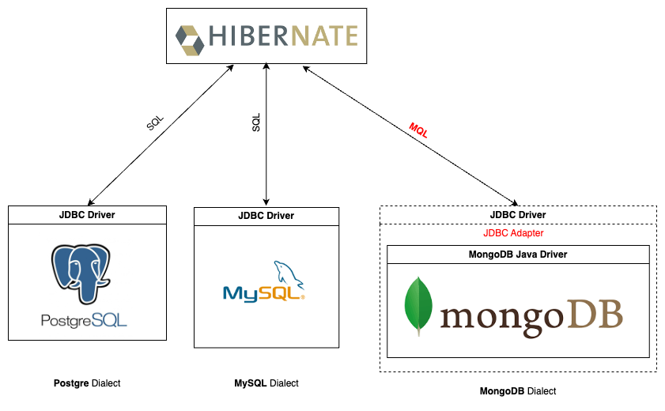

# A MongoDB Dialect for the Hibernate ORM

This project aims to provide a library to seamlessly integrate MongoDB with Hibernate ORM. Hibernate _ORM_ is a powerful **O**bject-**r**elational **m**apping tool. Due to the SQL and JDBC standards, Hibernate ORM could centralize each SQL vendor's idiosyncrasies in the so-called _Hibernate Dialect_. This project will include a document database member in the Hibernate's Dialect family.

## Overview

MongoDB speaks _MQL_ (**M**ongoDB **Q**uery **L**anguage in JSON format) instead of SQL. This project creates a MongoDB Hibernate Dialect by:

- create a JDBC adapter using [MongoDB Java Driver](https://www.mongodb.com/docs/drivers/java-drivers/)
- translate Hibernate's internal SQL AST into MQL

## Development

Java 17 is the JDK version for development.

Initially Hibernate ORM v6.6 is the dependency version.

### Build from source

#### Static code analysis

#### Code style check

We chose [Spotless](https://github.com/diffplug/spotless/tree/main/plugin-gradle) as a general-purpose formatting plugin, and [Palantir Java Format](https://github.com/palantir/palantir-java-format) as a Java-specific formatting tool integrated with it.

To check whether any format violation exists, run `spotlessCheck` gradle task. If any format violation is found during the previous step, run `spotlessApply` auto-formatting task to fix it automatically.

#### Code quality check

[Error Prone](https://github.com/tbroyer/gradle-errorprone-plugin) gradle plugin is chosen for Java code qualify analysis during Java compiling phrase. [NullAway](https://github.com/uber/NullAway) is a Java NPE prevention gradle plugin integrated with Error Prone. [JSpecify](https://jspecify.dev) annotations are used to help NullAway detect potential NPEs.

Both plugins are enabled on gradle's `compileJava` task.

## References

- [An Introduction to Hibernate 6](https://docs.jboss.org/hibernate/orm/6.6/introduction/html_single/Hibernate_Introduction.html)
- [A Guide to Hibernate Query Language](https://docs.jboss.org/hibernate/orm/6.6/querylanguage/html_single/Hibernate_Query_Language.html)
- [Hibernate User Guide](https://docs.jboss.org/hibernate/orm/6.6/userguide/html_single/Hibernate_User_Guide.html)